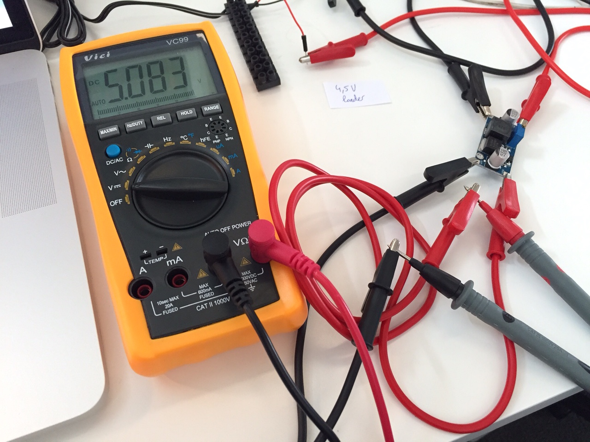

# step up converter test

Universal converter

### DC-DC Boost Converter Step Up Module 1-5V to 5V 500mA Power Module

<a href="http://www.aliexpress.com/item/1Pc-DC-DC-Boost-Converter-Step-Up-Module-1-5V-to-5V-500mA-Power-Module-Newest/32428340777.html" target="_blank">Bought $0.99 / piece</a>, not good results

3.2V become 5.2V

4.5V become 5.4V

5.0V become 5.6V

### 1A 3V to 5V DC-DC Converter Step Up Boost Module

<a href="http://www.aliexpress.com/item/On-Sale-1PC-New-1A-3V-to-5V-DC-DC-Converter-Step-Up-Boost-Module/32246064505.html" target="_blank">Bought $1.09 / piece</a>, good results

3.2V become 5.1V

4.5V become 5.1V

5.0V become 5.1V

### XL6009 DC-DC Adjustable Step-up boost Power Converter Board Module

<a href="http://www.aliexpress.com/item/1Pcs-XL6009-DC-DC-Adjustable-Step-up-boost-Power-Converter-Board-Module-Free-Shipping/2048353079.html" target="_blank">Bought $1.42 / piece</a>, very good results

3.2V become 5.0V, easily adjusted with precision with the potentiometer

4.5V become 5.0V, no adjustment needed, previous output voltage setting is kept

5.0V become 5.0V, no adjustment needed, previous output voltage setting is kept

